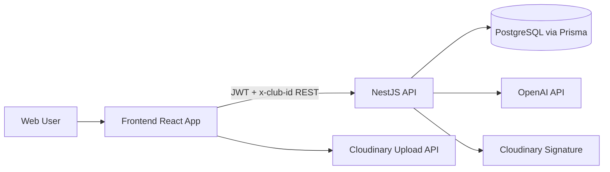
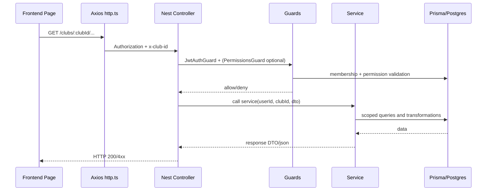
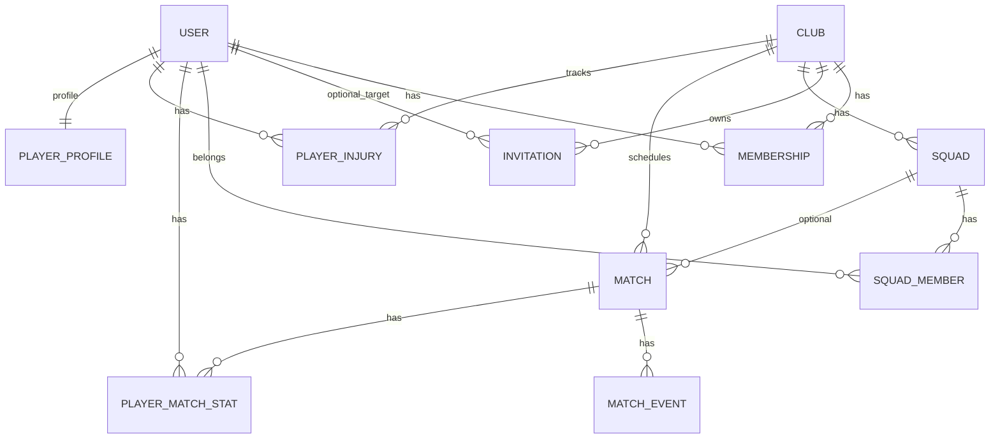

# EsportM Project Technical Architecture (HLD + LLD)

Last updated: 2026-04-27

## 1) Executive Summary

This repository is a Turborepo monorepo centered around:

- `apps/api`: NestJS backend (REST APIs, auth, authorization, domain modules, Prisma).
- `apps/frontend`: React + Vite frontend (dashboard/admin UX, React Query data layer).
- `apps/docs`: Next.js docs app scaffold (currently generic starter-level app).
- `packages/*`: shared package space (`@esportm/shared`, `@repo/ui`, lint/ts configs).

Core platform domain: club management, memberships/roles, squads, matches, stats, seasons, injuries, operations, marketplace, social, schedule, notifications, AI insights, and platform superadmin.

## 2) Monorepo Structure

### 2.1 Workspace Layout

- Root uses `pnpm` workspaces and Turborepo tasks (`build`, `dev`, `lint`, `check-types`).
- Workspace members:
  - `apps/*`
  - `packages/*`

### 2.2 Runtime Apps

- `apps/api`
  - NestJS 11
  - Prisma 6 (`@prisma/client` + `prisma`)
  - JWT auth (`@nestjs/jwt`, `passport-jwt`)
  - Swagger available at `/docs`
- `apps/frontend`
  - React 19 + Vite
  - Axios transport layer
  - TanStack React Query
- `apps/docs`
  - Next.js app scaffold

## 3) Connection Types and Data Paths

## 3.1 Client -> API Connection

- Protocol: HTTP/JSON REST (deployment should use HTTPS in production).
- Frontend base URL resolution:
  - `VITE_API_BASE_URL`
  - fallback `VITE_API_URL`
  - fallback `http://localhost:4000`
- Auth transport:
  - `Authorization: Bearer <accessToken>`
- Tenant/club context transport:
  - `x-club-id: <activeClubId>`
- Axios interceptor behavior:
  - Adds `Authorization` and `x-club-id` for non-public auth routes.
  - Skips token injection for `/auth/login` and `/auth/register`.

## 3.2 API -> Database Connection

- ORM: Prisma Client.
- DB provider: PostgreSQL.
- Connection string: `DATABASE_URL`.
- Prisma lifecycle:
  - API startup: `PrismaService.onModuleInit()` calls `$connect()`.
  - API shutdown: `onModuleDestroy()` calls `$disconnect()`.
- Access pattern:
  - Prisma is a global Nest module and injected into services.
  - Typical read APIs:
    - membership/permission check
    - scoped query by `clubId` and/or `userId`
  - Typical write APIs:
    - direct `create/update/upsert`, sometimes inside `$transaction`.

## 3.3 External Service Connections

- OpenAI:
  - Module: AI service.
  - Outbound call: `POST https://api.openai.com/v1/chat/completions`.
  - Config vars: `OPENAI_API_KEY` (or `AI_OPENAI_API_KEY`), optional model override.
- Cloudinary:
  - Social module signs upload requests on backend.
  - Frontend uploads media directly to Cloudinary signed endpoint.
  - Config vars: `CLOUDINARY_CLOUD_NAME`, `CLOUDINARY_API_KEY`, `CLOUDINARY_API_SECRET`, optional folder.

## 4) HLD (High-Level Design)

## 4.1 System Context (Logical)

## 4.2 Backend Layering

- Entry:
  - `main.ts` bootstraps app, CORS, validation, Swagger.
- App composition:
  - `AppModule` imports all domain modules + `PrismaModule` + `AuthorizationModule`.
- Security:
  - JWT guard (`JwtAuthGuard`) for authentication.
  - `PermissionsGuard`, `RolesGuard`, `ClubRolesGuard`, `PlatformAdminGuard` for authorization.
- Domain modules:
  - Each module has controller + service (+ DTOs).
  - Services access Prisma directly.

## 4.3 Frontend Layering

- Routing:
  - `App.tsx` defines public routes, protected routes, admin shell, dashboard shell, platform route.
- Data access:
  - `src/api/*.api.ts` modules call `http` axios instance.
  - React Query hooks (`src/hooks/*`) cache/fetch server state.
- Auth context:
  - Local storage keys: `accessToken`, `activeClubId`, `activeDashboardRole`.

## 4.4 Request Lifecycle (Typical Club-Scoped Endpoint)

## 5) Database Schema (Prisma) - Domain-Oriented View

## 5.1 Core Identity and Access

- `User`
  - unique `email`
  - optional `isPlatformAdmin`
- `Club`
  - unique `slug`
  - feature toggles (`aiEnabled`, `marketplaceEnabled`, `socialEnabled`)
  - subscription fields (`subscriptionStatus`, price, cycle dates)
- `Membership`
  - join entity (`userId`, `clubId`) with unique composite key
  - `primary` role + `subRoles[]`
- `ClubRoleSetting`
  - per-club role enable/disable matrix
- `Invitation`
  - invite/assignment tokens, primary/sub roles, club/user links
- `ScopeGrant`
  - optional extra scope grants by membership

## 5.2 Sports and Competition Domain

- `Squad`, `SquadMember`
- `Match`, `MatchEvent`
- `MatchLineup`, `MatchLineupPlayer`
- `PlayerMatchStat`
- `Opponent`
- `Season`, `SeasonTeam`, `SeasonMatch`, `SeasonStanding`, `SeasonGame`
- `PlayerProfile`, `PlayerInjury`
- `PlayerWellnessEntry`, `PlayerTrainingLoadEntry`

## 5.3 Operations and Communication

- `ClubTask`
- `ClubMessage`
- `ScheduleEvent`
- `Notification`
- `DashboardAnalyticsEntry`

## 5.4 Marketplace and Social

- Marketplace:
  - `MarketplaceListing`
  - `MarketplaceOffer`
- Social:
  - `SocialPost`
  - `SocialMedia`
  - `SocialComment`
  - `SocialReaction`

## 5.5 Key Indexing/Constraints Strategy

- Identity uniqueness:
  - `User.email` unique
  - `Club.slug` unique
  - `Invitation.tokenHash` unique
- Access integrity:
  - `Membership(userId, clubId)` unique
- Domain consistency:
  - `SeasonGame.matchId` unique
  - `SeasonMatch.matchId` unique
  - `MatchLineup(matchId, side)` unique
  - `PlayerMatchStat(matchId, userId)` unique
- Query acceleration:
  - frequent indexes on `clubId`, `userId`, status fields, and time fields.

## 5.6 ER Snapshot (Simplified)

## 6) LLD (Low-Level Design) - Backend Modules

Legend:
- Route base: controller base path.
- Guarding: auth/authorization entry pattern.
- Data: main Prisma models touched by service.

## 6.1 Auth and User Context

- `auth`
  - Route base: `/auth`
  - Endpoints: `register`, `login`, `me`
  - Guarding: `JwtAuthGuard` on `me`
  - Data: `user`, `membership`, `playerProfile`
  - Notes:
    - JWT signed using `JWT_ACCESS_SECRET`.
    - Platform-admin resolved from DB flag + allowlist emails.
- `users`
  - Route base: root-level (`/auth-check`, `/me`)
  - Guarding: `JwtAuthGuard`
  - Data: `user`

## 6.2 Club and Membership Lifecycle

- `clubs`
  - Route base: `/clubs`
  - Endpoints include:
    - create club, my clubs, club details/theme
    - invite and signup assignment
    - members list/update/remove
  - Guarding:
    - JWT + `PermissionsGuard` on role-sensitive actions
  - Data:
    - `club`, `membership`, `invitation`, `clubRoleSetting`, `user`
- `invitations`
  - Route base: `/invitations`
  - Endpoints:
    - validate token, accept invite
    - my-pending assignments, accept assignment
    - revoke/resend
  - Data:
    - `invitation`, `user`, `membership`, `clubRoleSetting`

## 6.3 Team and Match Operations

- `squads`
  - Route base: `/clubs/:clubId/squads`
  - Guarding:
    - JWT + permissions (`squads.read`/`squads.write`)
  - Data:
    - `squad`, `squadMember`, `membership`
- `matches`
  - Route base: `/clubs/:clubId/matches`
  - Features:
    - create/list/get, status update
    - event logging
    - lineup workspace/home/away save
  - Guarding:
    - JWT + permissions (`matches.*`, `lineups.*`)
  - Data:
    - `match`, `matchEvent`, `matchLineup`, `matchLineupPlayer`, `membership`, related `squad` and health tables
  - Transaction usage:
    - event writes and lineup updates

## 6.4 Player, Medical, Stats

- `players`
  - Route base: root and `/clubs/:clubId/players/...`
  - Features:
    - self profile read/update
    - club player listing
    - training load list/create
  - Guarding:
    - JWT, plus permissions for club-scoped operations
  - Data:
    - `playerProfile`, `playerWellnessEntry`, `playerTrainingLoadEntry`, `playerInjury`, `membership`
- `injuries`
  - Route base: `/clubs/:clubId/injuries`
  - Guarding:
    - JWT + permissions (`injuries.read`/`injuries.write`)
  - Data:
    - `playerInjury`, `membership`, `user`
- `stats`
  - Route base: `/clubs/:clubId/stats`
  - Features:
    - recompute match stats
    - match/player summary
    - leaderboard
  - Guarding:
    - JWT + permissions (`stats.read`, `stats.recompute`, `leaderboards.read`)
  - Data:
    - `playerMatchStat`, `match`, `matchEvent`, `matchLineup*`, `membership`
  - Transaction usage:
    - recompute/cache replacement flow
- `leaderboards`
  - Route base: `/clubs/:clubId/leaderboards`
  - Data:
    - `seasonGame`, `playerMatchStat`, `membership`

## 6.5 Seasons and Opponents

- `seasons`
  - Route base: `/clubs/:clubId/seasons`
  - Features:
    - season CRUD-lite, teams, match linking, standings recompute
  - Guarding:
    - JWT + permissions (`seasons.read`/`seasons.write`)
  - Data:
    - `season`, `seasonTeam`, `seasonMatch`, `seasonStanding`, `match`, `membership`
  - Transaction usage:
    - team/standing initialization and standings recompute
- `opponents`
  - Route base: `/clubs/:clubId/opponents`
  - Guarding:
    - JWT + permissions (`opponents.read`/`opponents.write`)
  - Data:
    - `opponent`, `membership`

## 6.6 Dashboards and Operations

- `dashboards`
  - Route base: `/dashboard`
  - Features:
    - overview/charts/recent
    - analytics list/create
  - Guarding:
    - JWT, analytics create adds `PermissionsGuard` (`analytics.write`)
  - Data:
    - `membership`, `match`, `playerMatchStat`, `playerInjury`, `dashboardAnalyticsEntry`, etc.
- `operations`
  - Route base: `/clubs/:clubId/operations`
  - Features:
    - training metrics, tasks, feed/messages
  - Guarding:
    - JWT + permissions (`operations.read`/`operations.write`)
  - Data:
    - `clubTask`, `clubMessage`, `match`, `playerInjury`, `playerMatchStat`, `invitation`, `membership`

## 6.7 Platform and Feature Modules

- `platform`
  - Route base: `/platform`
  - Guarding:
    - `JwtAuthGuard` + `PlatformAdminGuard`
  - Features:
    - platform overview
    - club governance toggles/subscription
    - per-club role matrix
    - platform-admin user management
  - Data:
    - `club`, `clubRoleSetting`, `user`, `membership`
- `marketplace`
  - Route base: `/marketplace`
  - Guarding:
    - class-level JWT guard
  - Features:
    - listing browse/upsert
    - offer create/accept/reject
    - recruiter and player offer views
  - Data:
    - `marketplaceListing`, `marketplaceOffer`, `membership`, `user`
  - Transaction usage:
    - accept-offer membership/listing/offer updates in one transaction
- `social`
  - Route base: `/social`
  - Guarding:
    - class-level JWT guard
  - Features:
    - feed, signed upload config, post creation, likes/comments
  - Data:
    - `socialPost`, `socialMedia`, `socialComment`, `socialReaction`, `user`
- `ai`
  - Route base: `/clubs/:clubId/ai`
  - Guarding:
    - JWT + permissions (`stats.read` / `operations.read`)
  - Features:
    - insights/schedule/skills/recommendations
    - assistant answer via OpenAI with rule-based fallback
  - Data:
    - match, stats, injuries, tasks, messages, memberships
- `schedule`
  - Route base: `/clubs/:clubId/schedule`
  - Guarding:
    - class-level JWT guard
  - Features:
    - schedule create/list, target groups, player-private visibility
    - notification fan-out on creation
  - Data:
    - `scheduleEvent`, `membership`, `notification`
- `notifications`
  - Route base: `/notifications`
  - Guarding:
    - class-level JWT guard
  - Features:
    - list per user (+ optional club filter), mark read
  - Data:
    - `notification`

## 7) LLD - Frontend Modules

## 7.1 App Routing and Shells

- Public routes:
  - `/`, `/login`, `/register`, `/invitations/accept`
- Protected feature routes:
  - `/dashboard/*`, `/admin/*`, `/platform`, `/marketplace`, `/ai`
- Layouts:
  - `AppShell` for dashboard feature surfaces
  - `AdminShell` for admin console

## 7.2 Data-Fetching Pattern

- Transport:
  - `src/api/http.ts` axios singleton
- Query layer:
  - React Query hooks (`useDashboard`, `useOperations`, `useNotifications`, etc.)
- Cache refresh strategy:
  - explicit `refetch()` and mutation-driven invalidation/refetch in pages.

## 7.3 Frontend API Modules

- `admin.api.ts`: large aggregated API surface for clubs/admin/platform modules.
- `dashboard.api.ts`: role-lensed dashboard endpoints + analytics create.
- `players.api.ts`: self health/profile/history and training loads.
- `operations.api.ts`: task/message/ops feeds.
- `marketplace.api.ts`: listing and offers.
- `social.api.ts`: feed/actions + Cloudinary upload helpers and media preprocessing.
- `schedule.api.ts`: schedule event list/create.
- `notifications.api.ts`: notification list/read.
- `ai.api.ts`: AI insights/assistant.

## 7.4 Frontend Authorization Model

- Uses `useMe()` and role-policy utility for:
  - route protection
  - dashboard landing resolution
  - permission-based tab visibility

## 8) Current Architecture Notes / Gaps

## 8.1 Permission Matrix Drift

- Frontend role policy includes `schedule.read` and `schedule.write`.
- Backend role policy currently does not include explicit `schedule.*` permissions.
- Result:
  - frontend can gate schedule views,
  - backend schedule endpoints are JWT protected but not permission-decorator guarded.

## 8.2 Guarding Inconsistency by Module

- Most club-sensitive modules use `PermissionsGuard`.
- Some feature modules are currently JWT-only at controller level (`schedule`, `social`, `marketplace`, `notifications`).
- This is valid for current behavior, but should be normalized if strict policy enforcement is required across all modules.

## 8.3 Shared Package Underuse

- `packages/shared` defines role constants/schemas but frontend/backend still keep role-policy matrices separately.
- This increases drift risk.

## 9) Phase 2+ Planning (Recommended)

Below is a practical execution plan starting from current state.

## 9.1 Phase 2 - Policy Unification and Access Hardening

Goal: make authorization deterministic across frontend/backend.

Scope:

- Add `schedule.read`/`schedule.write` to backend permission model.
- Add `PermissionsGuard` enforcement for schedule endpoints.
- Review `social`, `marketplace`, `notifications` and apply explicit permission decorators where needed.
- Move shared role/permission constants to one shared contract package used by both apps.

Deliverables:

- Single source of truth for permission keys.
- No endpoint relying on UI-only authorization assumptions.
- Regression test matrix for role/permission routes.

Acceptance criteria:

- Every protected route has explicit backend permission behavior.
- Frontend permission keys compile from shared contract.
- No permission key mismatch between FE and BE.

## 9.2 Phase 3 - API Contract and Type Safety Layer

Goal: reduce integration bugs and speed feature delivery.

Scope:

- Generate typed API client from OpenAPI (Swagger) or shared Zod contracts.
- Replace broad `any` response handling in frontend API modules.
- Standardize API error envelope and pagination envelope.

Deliverables:

- Typed client package consumed by frontend.
- Contract tests for key module endpoints.

Acceptance criteria:

- Build fails on contract drift.
- Major dashboard/admin pages no longer depend on ad-hoc response normalization.

## 9.3 Phase 4 - Data Integrity and Performance

Goal: improve scalability and predictability under larger club/user volume.

Scope:

- Audit N+1 query patterns in dashboard/operations/ai services.
- Add selective composite indexes for hottest query paths.
- Introduce audit/event tables for sensitive state changes (role changes, platform toggles, offer acceptance).

Deliverables:

- DB performance baseline and optimization report.
- Migration set with new indexes and audit schema.

Acceptance criteria:

- Key dashboard and listing APIs stay within agreed p95 target under load tests.
- Sensitive writes are traceable with actor and timestamp.

## 9.4 Phase 5 - Async and Event-Driven Extensions

Goal: decouple heavy workflows and improve UX responsiveness.

Scope:

- Add job queue for expensive analytics and AI precompute.
- Event bus pattern for notifications and activity feed materialization.
- Optional WebSocket/SSE channel for realtime notifications.

Deliverables:

- Worker process + queue-backed tasks.
- Realtime notification channel.

Acceptance criteria:

- Heavy operations do not block request/response cycles.
- Users receive near-realtime updates for schedule/tasks/messages.

## 9.5 Phase 6 - Delivery and Operations Maturity

Goal: production-grade operability.

Scope:

- CI pipeline for lint/typecheck/tests/migration validation.
- Structured logging, tracing, and metrics dashboards.
- Backup/restore and migration rollback playbooks.

Deliverables:

- CI/CD gates and deployment runbooks.
- Observability dashboard set and alert policies.

Acceptance criteria:

- Controlled release process with rollback.
- Incident triage data available in logs/metrics/traces.

## 10) Practical Next Actions (Immediate)

1. Implement Phase 2 policy unification first.
2. Freeze and publish API contract boundary (Phase 3 kickoff).
3. Run a focused query/index audit for dashboard + operations + AI paths.

